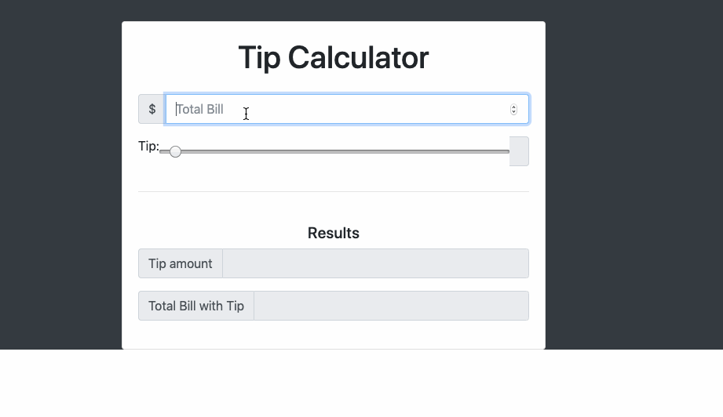

# Tip Calculator

Author: Eugene chung

A simple web application which allows user to calculate desired tip percentage based on price input.

## Time spent
 * Tutorials, research: 4 hours
 * Coding required stories: 10 minutes
 * Optional and extras: 30 minutes

## User stories

### Required
 * [x] User can enter total bill amount
 * [x] User can choose between at least three tip tiers (e.g. 15%, 18%, 20%) and see the total tip 
 * [x] User can see the total with tip

### Optional

 * [ ] Add custom CSS to the calculator inputs
 * [ ] Add a light/dark color theme toggle on the page
 * [ ] User can enter tax amount
 * [ ] Page is optimized for the viewport/browser size (i.e. scales to mobile & desktop sizes)
 * [ ] Remember the previous bill amount when the user re-opens the browser
 * [ ] Use [locale specific](https://developer.mozilla.org/en-US/docs/Web/JavaScript/Reference/Global_Objects/NumberFormat) currency and currency separators.

### Extra

 * ON-click sliding bar tool used to navigate desirede tip percentages.
 

## GIF Walkthrough

Markdown code to embed a GIF in your README file:

GIF created with [LiceCap](https://www.cockos.com/licecap/).

## Notes & shoutouts

Tell us more about your journey here or resources used. e.g. "Spent some additional time researching and playing with color options via CSS, and looking at MDN to understand localStorage. Shoutout to Luke for helping me with that controller issue!"
